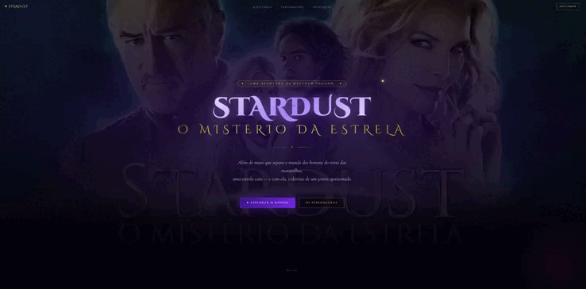

> 👉 **Acesse aqui:**  
>🔗 https://nexcel-atividade-avancada-bootstrap.vercel.app/
> ## 🎬 Demonstração
> 
---

# 🌠 Stardust: O Mistério da Estrela

> 🧩 **O que este projeto comprova:** SCSS modular, HTML5 semântico, JavaScript ES6+ (padrão IIFE), HTML5 Canvas e automação de build com Gulp (autoprefixer, minificação, BrowserSync).

Uma Landing Page cinematográfica e imersiva baseada no universo de *Stardust* (2007). Este projeto utiliza manipulação avançada de **Canvas**, animações de scroll customizadas e um workflow de automação profissional para entregar uma experiência de usuário mágica e performática.

## ✨ Funcionalidades em Destaque

*   **Starfield Engine (HTML5 Canvas):** Sistema de partículas dinâmico que gera um céu estrelado procedimental.
    *   **Twinkle Effect:** Estrelas com brilho oscilante via funções senoidais.
    *   **Chromatic Variety:** Algoritmo que distribui cores (Ouro, Lavanda e Branco) para profundidade visual.
    *   **Sparkle Crosses:** Renderização de brilhos em cruz para as estrelas de maior magnitude.
*   **Interactive Custom Cursor:** Cursor personalizado que reage a elementos clicáveis (links e cards), expandindo-se para melhorar o feedback visual.
*   **Scroll Reveal System:** Motor de animação leve que detecta a posição do scroll para revelar conteúdos de forma suave (Fade-in, Slide-left, Slide-right).
*   **UX & Performance:**
    *   **Staggered Animations:** Atrasos de transição calculados via JS para itens de grid.
    *   **Passive Listeners:** Otimização de eventos de scroll para manter a fluidez da página.
    *   **Smooth Navigation:** Scroll suave nativo para âncoras internas.

## 🚀 Tecnologias e Ferramentas

*   **Frontend:** HTML5 Semântico, SCSS (Arquitetura Modular) e Vanilla JavaScript (ES6+).
*   **Automação:** **Gulp** (Compilação, Autoprefixer, Minificação e BrowserSync).
*   **Assets:** Imagens otimizadas e fontes tipográficas via Google Fonts.

## 🛠️ Instalação e Uso

1.  **Clone o repositório:**
    ```bash
    git clone https://github.com/seu-usuario/stardust-landing.git
    ```

2.  **Instale as dependências:**
    ```bash
    npm install
    ```

3.  **Ambiente de Desenvolvimento:**
    ```bash
    npm run build
    ```
    *Isso iniciará o Gulp, abrirá o servidor local e monitorará mudanças em tempo real.*

## 📂 Arquitetura do JavaScript

O arquivo `main.js` foi estruturado sob o padrão **IIFE** (Immediately Invoked Function Expression) para evitar poluição do escopo global e garantir segurança:

*   **Cursor Engine:** Gerencia o estado e a posição do cursor customizado.
*   **Canvas Starfield:** Responsável pelo desenho e redimensionamento dinâmico do fundo estelar.
*   **Intersection Logic:** Sistema de revelação de elementos baseado na viewport.
*   **UI Tweaks:** Efeitos de transparência na navbar ao rolar e navegação suave.

---

### 🎨 Detalhes de Design
A paleta de cores e o comportamento das partículas foram ajustados para refletir a transição entre o mundo "comum" (Wall) e o reino mágico (Stormhold), utilizando contrastes profundos e brilhos sutis.

---
